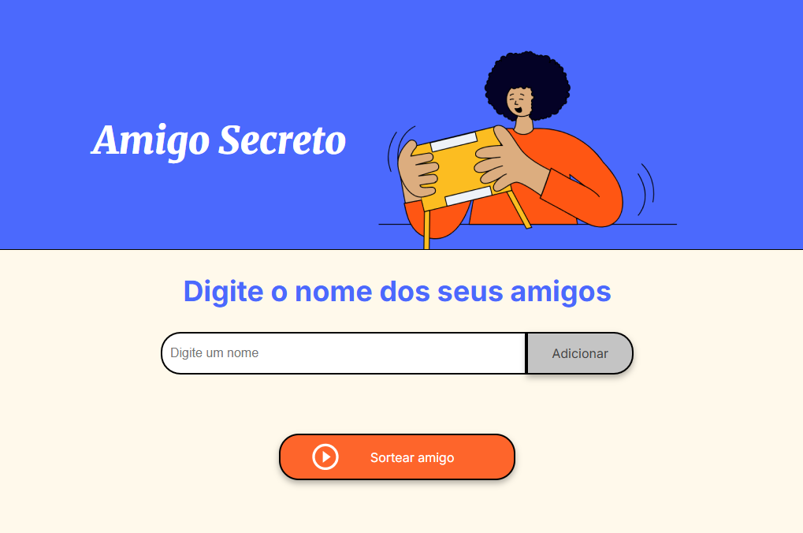
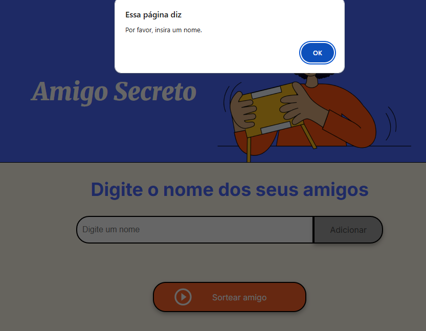
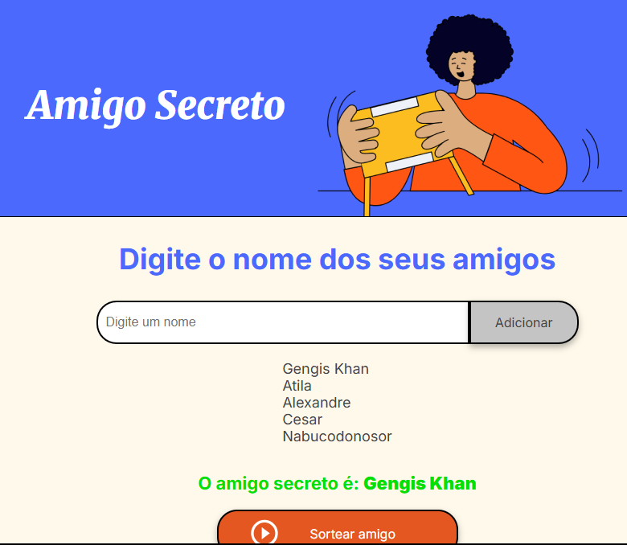

```markdown
# 🎁 Amigo Secreto Challenge

Projeto desenvolvido para sortear nomes aleatoriamente de uma lista de amigos fornecida pelo usuário. Esse projeto faz parte da disciplina de Lógica de Programação, módulo inicial do programa ONE, patrocinado pela Oracle em parceria com Alura e Labora.


## 📸 Screenshots

### Homepage


### Alerta - Campo Vazio


### Lista de Nomes


### Nome Sorteado


## 💻 Funcionalidades

- Adicionar nomes à lista de amigos
- Validação de campo vazio
- Sorteio aleatório de um nome da lista
- Interface responsiva e intuitiva

## 🛠️ Tecnologias Utilizadas

- HTML
- CSS 
- JavaScript

## 📝 Como Usar

1. Digite o nome do amigo no campo de input
2. Clique em "Adicionar" para incluir na lista
3. Repita o processo para adicionar mais amigos
4. Quando finalizar a lista, clique em "Sortear" para escolher aleatoriamente um nome

## ⚙️ Instalação

1. Clone este repositório
2. Abra o arquivo index.html no seu navegador
3. Comece a usar!

## 👩‍💻 Autor

Desenvolvido por [Otto Freitag]
```